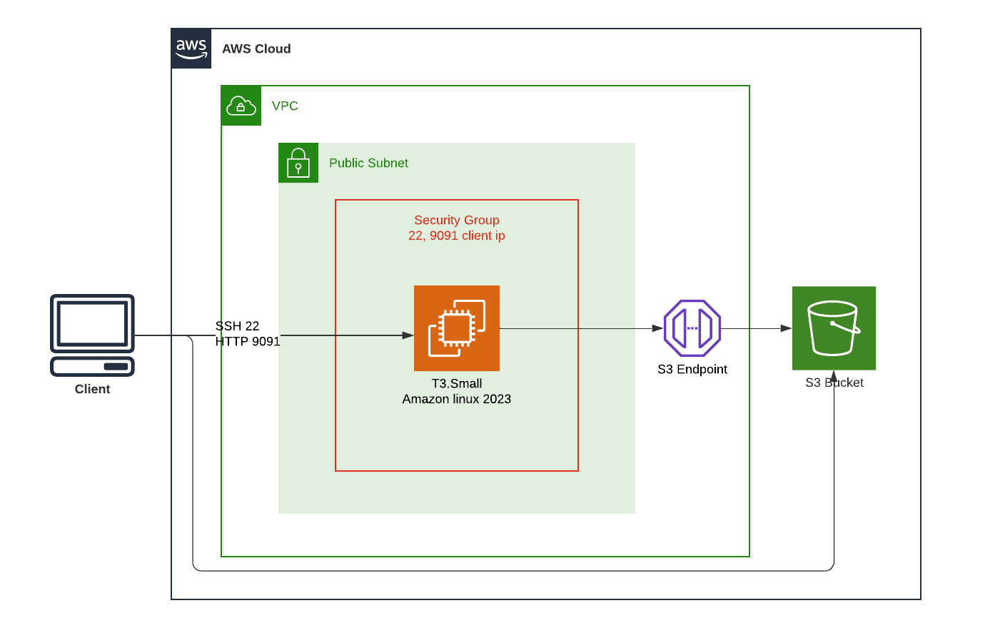

# TorrentBox
Terraform template that creates a truly ephemeral torrentbox which stores completed downloads in an S3 bucket.

## Usage
Clone this repo.

Authenticate with AWS (provide sufficient permissions to deploy the required resources)

Run terraform init:
```shell
terraform init
```
Run terraform apply:
```shell
terraform apply
```

When done, run terraform destroy:
```shell
terraform destroy
```


## Diagram
